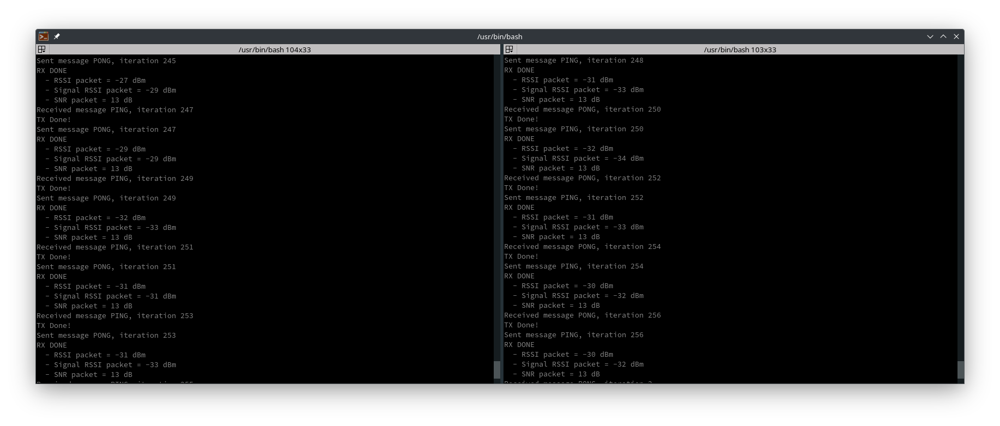

# Introduction

I have several Waveshare (https://www.waveshare.com/product/iot-communication/long-range-wireless/nb-iot-lora.htm) LoRa Hats lying around.  The Software available for them
at the time I wrote this was all based on older Semtech software libraries.

Semtech has since moved to:

See:  https://github.com/Lora-net/SWL2001

This is a port for Pico and Raspberry Pi Waveshare Hats listed below, in the Hardware section.  I did not implement FOUTA or STORE and Forward.  But basical LoRaWan
OTAA and Uplink/Status has been tested.

There are a couple of basic examples, one OTAA and a ping pong for general radio RX/TX based directly off the Semtech Example.

## otaa_example

This demonstrates the basics of using the smtc_modem api to connect to a IOT stack using OTAA.  It then does periodic uplinks of the boards temp.

## ping_pong

This is basic modem RX and TX between two modems.  It's heavily based off the orginal Semtech pingpong application in their examples.

To run it you'll need two units of course like so:

cp ping_pong.uf2 to each unit, or ping_pong.elf if your using debugger.  You should see terminal output like the following:

# Hardware

The following hardware was used for testing and development

## Waveshare LoRaWan Gateway for Raspberry Pi

https://www.waveshare.com/wiki/SX1302_LoRaWAN_Gateway_HAT

## Waveshare Lora Node for Raspberry Pi Pico

https://www.waveshare.com/wiki/Pico-LoRa-SX1262

https://www.waveshare.com/wiki/RP2040-LoRa

## Waveshare Lora Node for Raspberry Pi

https://www.waveshare.com/wiki/SX1262_XXXM_LoRaWAN/GNSS_HAT

# Building:

I build on Arch Linux but you should have no problems on most Linux Distros, you'll need at minimum cmake, and the build environment for your distro (build-essentials etc), as well as pico-sdk v2.0 if your going to build the pico versions.  

**only the sx1262 radio is supported, I have no other radios**

**set your region correctly for your country, in the top level CMakeLists.txt i.e. -DRADIO_REGION=US_915**

You configure the target board via the following:

PLATFORM_BOARD [ PICO | PICO2 | LINUX ]

i.e. To build for PICO2

<ol>
	<li>mkdir build_pico2 && cd build_pico2</li>
	<li>cmake -DPLATFORM_BOARD="PICO" -DPICO_SDK_PATH=/usr/share/pico-sdk -DRADIO_REGION=US_915 -DCMAKE_BUILD_TYPE=Release ..</li>	
</ol>

i.e. To build for LINUX

The LINUX Platform is a purely userspace implementation.  **Note:  Lora Basics Modem kinda expects a flash device for storing LoRa context and other stuff, in this
Linux example we dummy up flash with a file backed mmap.  So there is just a file flash.bin that gets created.  It will persist but you can nuke it if you want to 
clear things out.**

<ol>
	<li>mkdir build_linux && cd build_linux</li>
	<li>cmake -DPLATFORM_BOARD="LINUX" -DPICO_SDK_PATH=/usr/share/pico-sdk -DRADIO_REGION=US_915 -DCMAKE_BUILD_TYPE=Release ..</li>	
</ol>

For a complete Buildroot configuration to support this with the Waveshare Raspberry Pi GNSS_HAT on a Pi Zero 2W see:

https://github.com/CodeUnit10X/animal-farm

The configuration for Raspberry Pi Zero 2w, includes all the required prereqs.  To create everything in Buildroot for Pi running Linux you
can do the following:

<ol>
	<li>git clone https://github.com/buildroot/buildroot</li>
	<li>git clone https://github.com/CodeUnit10X/animal-farm</li>
	<li>cd <path/to/buildroot> && make BR2_EXTERNAL=</path/to/animal-farm> raspberrypi_2w_custom_defconfig</li>
	<li>make menuconfig External options -> pi application options -> [*] lorawan </li>
	<li>make</li>
</ol>

The initial build of buildroot can take a long time, but once its down you'll have a an sdcard.img in output/images folder of buildroot, that you use
on a pi zero 2w with the Waveshare hat.  The examples are located in /usr/bin.  You'd need to update for your Region and Dev/app eui's etc.  Generally
I update the package .mk to point to a local clone of the repo and modify it there.  

If you want to support another Pi (3, 4B, etc), Take a look at how I did it under:

https://github.com/CodeUnit10X/animal-farm/blob/main/board/raspberrypi/raspberry_pi_zero_2w/

You'll need UIO driver support in your kernel.

CONFIG_UIO=y
CONFIG_UIO_PDRV_GENIRQ=y

Also look at the following:

https://github.com/CodeUnit10X/animal-farm/blob/main/board/raspberrypi/raspberry_pi_zero_2w/cmdline.txt

https://github.com/CodeUnit10X/animal-farm/blob/main/board/raspberrypi/raspberry_pi_zero_2w/config.txt

To build examples standalone (outside Buildroot):

cmake -DPLATFORM_BOARD="LINUX" -DCMAKE_BUILD_TYPE=Release -DCMAKE_TOOLCHAIN_FILE=/path/to/toolchain -DRADIO_REGION=US_915 ..

**note the Linux port is entirely userspace, and thus running on a general purpose OS.  While it seems to work fine on my test system keep in mind your mileage may vary depending on what else is running on your system, as LoRaWan RX timing is pretty precise.**

# System Setup

The following is my basic setup using Chirpstack.

## Gateway setup

I used Chirpstack v4.6.0 on my Waveshare gateway.  The Waveshare hat was connected to a Pi 4B.  I installed the stock openWRT images on an sdcard.  Chirp stack is well documented, start at the below link:

https://www.chirpstack.io/docs/chirpstack-gateway-os/install/raspberry-pi.html

Create a device profile.

Its important here to make sure your MAC Version and Regional parameters match what LoRa Basics Modem supports.  LoRaWAN v1.0.4 and RP002 v1.0.3.  Refer to Semtech's documentation on this but currently thats it.

Create an appliction and add a device.

As long as your on a small isolated network you can use whatever for Device EUI just make sure it matches what you have in the otaa_example.

Same with Application Key

Once everything is setup you should start to see frame and events for your application.  In this case a successful Join Request/Accept then uplinks.

**note:  Join times can be a bit slow, I believe with my configuration the concentrator was only scanning the first bank of channels 0-7 and the Lora Basics Modem library will go through the entire channel list 0-64.  I did not see any way to mask channel list in Lora Basics Modem API.    

## TODO

- Add GPS support for GNSS HAT
- New Modem test application using the smtc_modem_test stuff