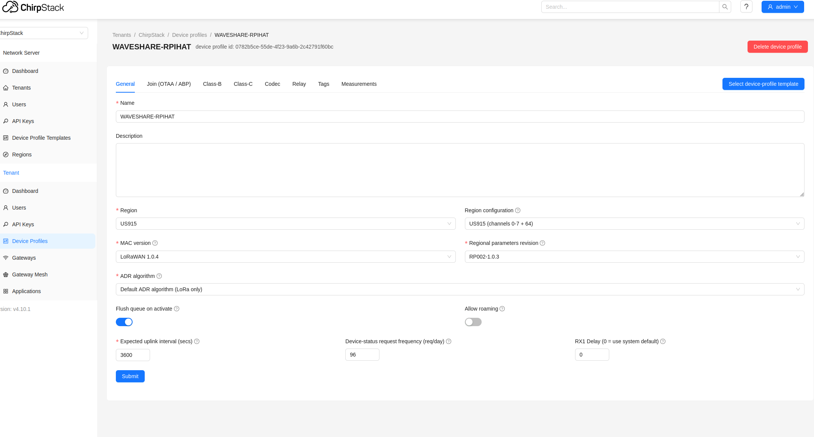
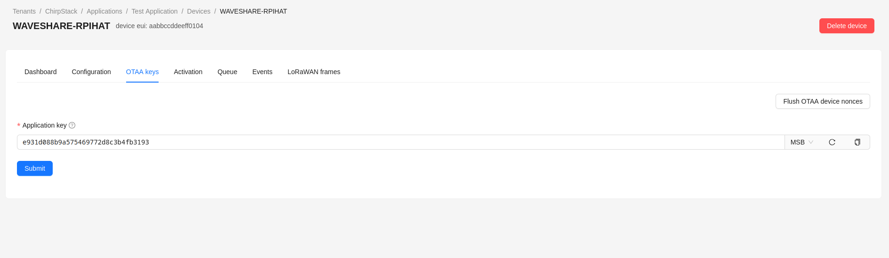
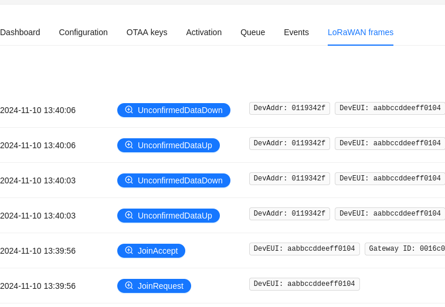

# Introduction

This is a port of Semtechs Lora Basics Modem API for several Waveshare Raspberry Pi Lora Hats, on pico, pico2 and a user space port for Linux.

See:  https://github.com/Lora-net/SWL2001

There are a couple real basic examples, based off Semtech's examples, mainly the following:

## otaa_uplink

This is simple otaa connection to a LoRaWAN gateway and sends up some periodic uplinks.

## ping_pong

This is basic modem RX and TX between two modems.

# Hardware

The following hardware was used for testing and development

## Waveshare LoRaWan Gateway for Raspberry Pi

https://www.waveshare.com/wiki/SX1302_LoRaWAN_Gateway_HAT

## Waveshare Lora Node for Raspberry Pi Pico

https://www.waveshare.com/wiki/Pico-LoRa-SX1262

## Waveshare Lora Node for Raspberry Pi

https://www.waveshare.com/wiki/SX1262_XXXM_LoRaWAN/GNSS_HAT

# Building:

The build system uses cmake on a Linux system.

**Currently only the sx1262 radio is supported.**

**set your region correctly for your country, in the top level CMakeLists.txt i.e. -DRADIO_REGION=US_915 **

PLATFORM_BOARD [ PICO | PICO2 | RPI_LINUX ]

cmake -DPLATFORM_BOARD="PICO" -DRADIO_REGION=US_915 -DCMAKE_BUILD_TYPE=Release ..

The linux userspace version was intended to be used with my buildroot images, to build standalone you'll need to specify a toolchain file

cmake -DPLATFORM_BOARD="RPI_LINUX" -DRADIO_REGION=US_915 -DCMAKE_BUILD_TYPE=Release -DCMAKE_TOOLCHAIN_FILE=<path to your toolchainfile.cmake> ..

# System Setup

## Gateway setup

I used Chirpstack v4.6.0 on my Waveshare gateway.  The Waveshare hat was connected to a Pi 4-B.  I installed the stock openWRT images on an sdcard.  Chirp stack is well documented, start at the below link:

https://www.chirpstack.io/docs/chirpstack-gateway-os/install/raspberry-pi.html

Create a device profile.

Create an appliction and add a device.

